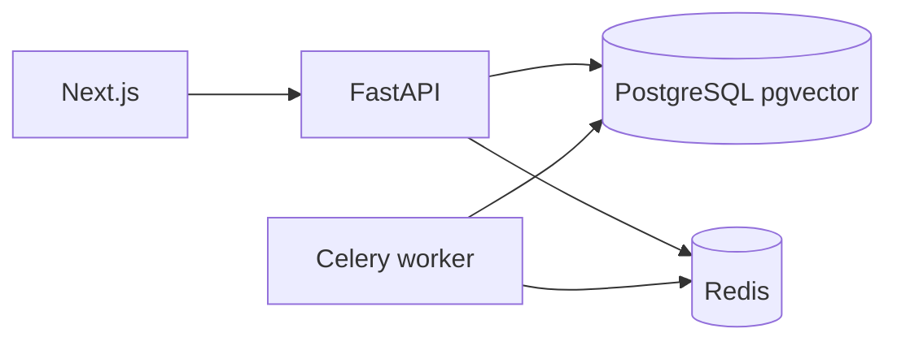

# Arquitectura

- **API**: routers delgados; lógica en `app/services` y `app/rag`.
- **Persistencia**: documentos, chunks con embeddings `vector(1536)`, consultas, trazas de recuperación, feedback y corridas de evaluación.
- **Recuperación**: semántica (cosine en pgvector) + BM25 en memoria sobre el corpus indexado, fusión RRF y score híbrido ponderado.
- **Generación**: OpenAI con JSON mode, prompt grounded y citas restringidas a chunks recuperados.
- **Workers**: Celery para tareas de ingesta asíncrona (`ingest_file`).
